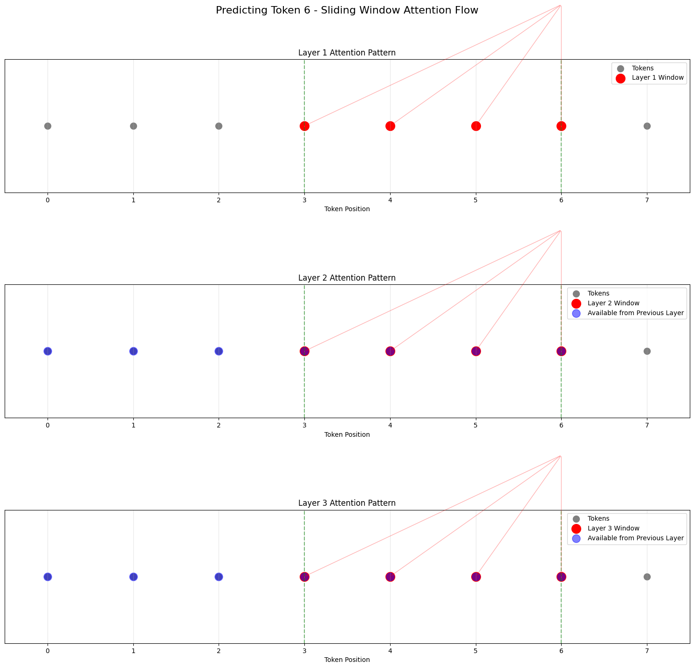
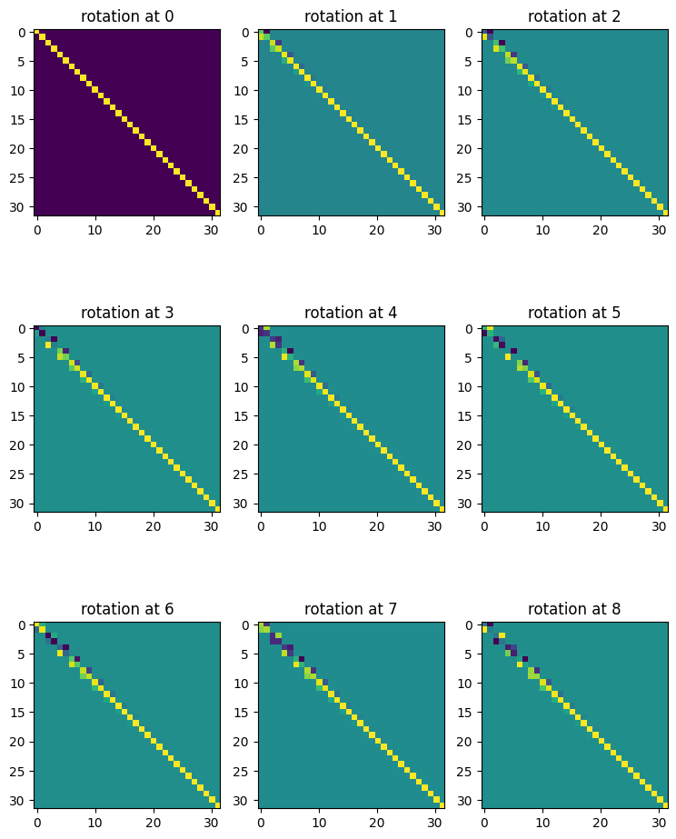
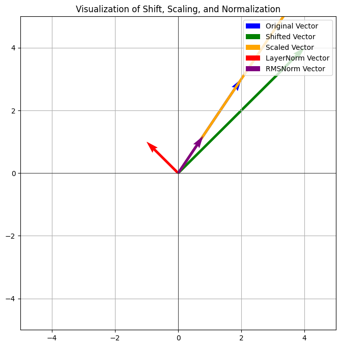

# GPT-2 Reimplementation with "NORM" Architecture

## Overview

This repository contains a reimplementation of the GPT-2 architecture, incorporating elements of what Reka has termed the ["NORM"](https://publications.reka.ai/reka-core-tech-report.pdf) architecture. This term reflects a common, robust architecture adopted by many open-source LLMs like Mistral, Llama, etc. This implementation aims to illustrate the key differences between the original GPT-2 and these modern architectural choices.

The following modifications have been made:


- **Activation Function:**  Replaced GeLU with SwiGLU (Shazeer, 2020). Please check out my previours [blog post](https://motsepe-jr.github.io/blogs/gelu/), I compare these activation functions in more detail.

- **Multi and Group Query Attention:** Integrate Multi and Grouped Query Attention (Shazeer, 2019). Please seee experiment.ipynb



- **Positional Embeddings:**  Replaced learned absolute positional embeddings with Rotary Positional Embeddings (RoPE) (Su et al., 2021). RoPE encodes positional information directly into the attention mechanism through rotation matrices, enabling better generalization to longer sequences than traditional methods. 



- **Normalization :**  Replaced Layer Normalization with RMS Normalization (Zhang and Sennrich, 2019). RMSNorm offers similar performance to Layer Normalization but with reduced computational overhead, due to removal of re-centering.



- **Sliding Window Attention with Mask:** Restricting attention to a local window for efficiency.


## Purpose

This code serves educational purposes, allowing users to explore and understand the architectural differences between the original GPT-2 and the prevalent design choices in modern transformer-based language models. It facilitates experimentation with these modifications and their impact on model behavior.

## Requirements

- Python 3.x
- PyTorch -> Only dependency is Torch


## Installation 

To install the necessary dependencies, run:

```bash
pip install -r requirements.txt
```

## Initiate Pre-Training 

To train mini-gpt-2, run;

```bash
python train_gpt2.py
```

References
- [Ohara](https://github.com/joey00072/ohara/blob/master/ohara/swa.py): Thanks to  🖤 joey and Andrej Karpathy 🖤

- Ainslie, J., Shazeer, N., Davis, A., Stern, M., Le, Q. V., & Petrov, S. (2023). GQA: Training Generalized Multi-Query Transformer Models from Multi-Head Checkpoints. arXiv preprint arXiv:2305.13245.

- Beltagy, I., Peters, M. E., & Cohan, A. (2020). Longformer: The Long-Document Transformer. arXiv preprint arXiv:2004.05150.

- Shazeer, N. (2019). Fast Transformer Decoding: One Write-Head is All You Need. arXiv preprint arXiv:1911.02150.

- Su, J., Lu, Y., Pan, S., Murtadha, A., Gong, B., & Zhou, J. (2021). RoFormer: Enhanced Transformer with Rotary Position Embedding. arXiv preprint arXiv:2104.09864.

- Zhang, B., & Sennrich, R. (2019). Root Mean Square Layer Normalization. arXiv preprint arXiv:1910.07467

